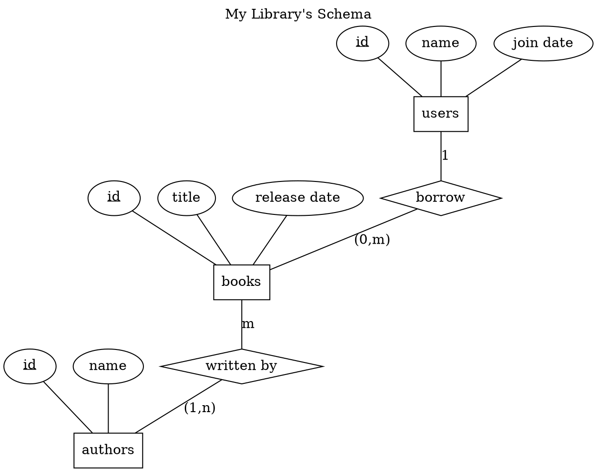

ERD Maker
========


is a language, reference compiler and editor designed to create ER Diagram
in Elmasri notation from a textual representation. The compiler will output
GraphViz source code, which can then be compiled by GraphViz (either by the
compiler itself or manually) to produce the real diagram image.

ERD Maker Language
==================

The following grammar defines ERD Maker Language:

```ebnf
erd               = "diagram" [ identifier ] "{" entities relationships "}" .
entities          = "entities" "{" { entity } "}" .
entity            = identifier "{" { fields } "}" .
fields            = field { "," field } .
field             = identifier [ "*" ] .
relationships     = "relationships" "{" { relationship } "}" .
relationship      = quantifier [ "," quantifier ] identifier identifier
                    quantifier [ "," quantifier ] identifier .
identifier        = word-identifier | quoted-identifier .
word-identifier   = letter { letter } .
quoted-identifier = "'" word-identifier "'" { quoted-identifier } .
quantifier        = "0" | "1" | "m" | "n" .
letter            = "A" | "B" | "C" | "D" | "E" | "F" | "G" | "H" | "I" | "J"
                  | "K" | "L" | "M" | "N" | "O" | "P" | "Q" | "R" | "S" | "T"
                  | "U" | "V" | "W" | "X" | "Y" | "Z"
                  | "a" | "b" | "c" | "d" | "e" | "f" | "g" | "h" | "i" | "j"
                  | "k" | "l" | "m" | "n" | "o" | "p" | "q" | "r" | "s" | "t"
                  | "u" | "v" | "w" | "x" | "y" | "z"
                  | "0" | "1" | "2" | "3" | "4" | "5" | "6" | "7" | "8" | "9"
```

Comment starts with `#` character and spans to the end of the line, it can appear
anywhere and is insignificant to the source semantics.

Semantics
=========

There are still small amount of semantics, so it should be enough to cover it here.

- Field marked with asterisk (e.g. id*) is a primary key

Usage
=====

```text
$ ./emlc --help
ERD Maker Language Compiler v0.9
usage: emlc {options}
options:
-i,--input      Input filename. If not specified, read from standard input 
                without waiting
-o,--output     Output filename. If not specified, write to standard output
-h,--help       Show this message
```

Example
=======

Input
-----

```text
diagram 'My Library''s Schema' {
  # id is primary key of every entity
  entities {
    users { id*, name, 'join date' }
    books { id*, title, 'release date' }
    authors { id*, name }
  }
  # This is an example of one to many
  # and many to many relationships
  relationships {
    1 users borrow 0,m books
    m books 'written by' 1,n authors
  }
}
```

Output
------



To Do
=====

Compiler:

- Partial participation
- Derived attribute support
- Weak entity support

Editor:

- Configuration dialog for customizing emlc and dot location
  (perhaps their name, too)
- Save image in formats other than PNG (too easy, actually)

Changelog
=========

2016-01-04:

- Editor implemented
- Build modes for i386-linux, x86_64-linux, i386-win32 and x86_64-win64

2016-01-03:

- Replace ReadChar code with simpler and much more efficient one
- Add support for line comment

2016-01-02:

- Underlining of primary key implemented
- Documentation refactoring
- Move diagram title to top

2010-09-09:

- Fixed bug when relationships of different entities have the same name,
  they're joined as one relationship
- Added overlap="scale" to eliminate overlap between entities, attributes, and
  relationships
- Some memory (> 100 memory blocks saved) and speed enhancements (I didn't
  benchmark this, but it sure is faster) in GetCode method implementations due
  to better coding practice
- Added semantic analysis for duplicate entity

2010-09-05:

- Removed EEndOfFile, overkill, useless, and cause leaks
- Fixed diagram title in output code
- Lexical element change for quoted identifier to use Pascal style strings,
  to be able to use quotes in the lexeme
- Added semantic analysis for undeclared entity

2010-08-29:

- Compiler options implemented
- Added -i,--input and -o,--output compiler option

2010-08-24:

- AST and code generator implemented

2010-08-19:

- Parser implemented

2010-08-18:

- Initial commit
- Lexer done
